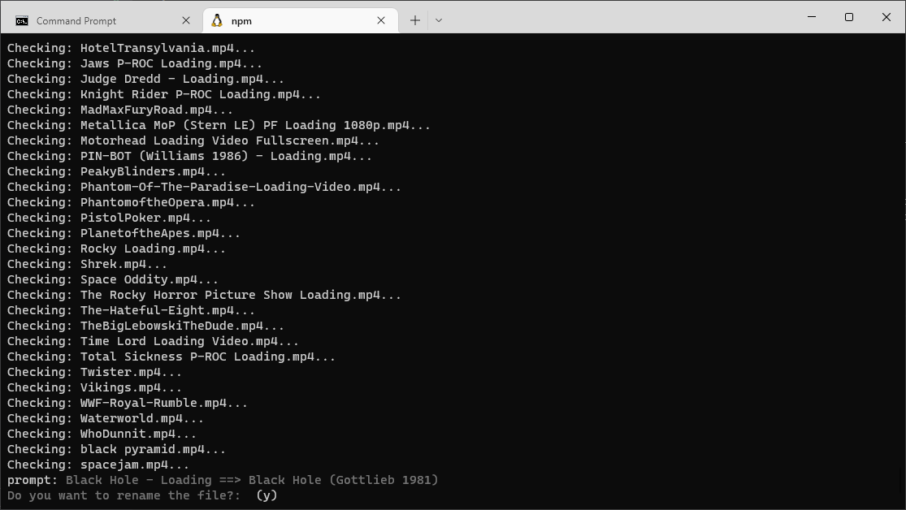

# PinballY File Rename Utility

I whipped this up to do some easy renaming of PinballY assets. The assets need to match the table name, so this will take your PBY DB file and try to fuzzy match assets with existing table names (by the file name or the "proper" table name) and then rename those assets so PBY will be happy.

## Pre-Requisites

This runs node, so you need that setup. If you are on Windows and don't have node installed, and maybe are intimidated by the idea of installing node I'd suggest Windows Subsystem for Linux (WSL). I know, you may be thinking, "I am intimidatad by node, _why wold I want to use Linux?!?_" and that is a fair point. However, Windows has made running Linux a breeze, and I find a *nix system just works so much easier with node. Plus, there is a ton of documentation for WSL and most node documentation you will find is going to probably be *nix-centric. That said, teaching how to install node is not within the scope of this project...

_Assuming_ you have node installed, you will want to install the node package dependencies:

```
npm i
```

## How doI use it?

First, you will want to copy `config-example.yaml` to `config.yaml` and then edit to your system's setup. Using WSL, there re mounts to all your local drives, so it is pretty easy to map the path to PBY DB's, assets, etc.

The app can match 2 types of files right now: screen shots and loading animations. I originally used this to match the various Pinball FX3 screen shots I found to PBY standards, and it worked quite well. After that, I wanted to do the same fuzzy matching for loading animations, and since I already have all the FX3 tables, I primarily use this for loading animations. You will want to set the `type` accordingly in the yaml file.

Once you have sdet the paths and the type of files you want to rename, starting the app is simple:

```
npm start
```

If you have everything configured properly you should see output that loks imilar to this:



The prompt shows you the name of the current file (`Black Hole - Loading` in this case) and the potential match to rename to (`Black Hole (Gottlieb 1981)` in this case). If you want to rename the file, just press `y` (or `enter` since it is the default). Press 'n' if you do not wish to rename the file.

> Aside: You can change the default selection if you are worried about making a mistake

### "Renaming"

The use of "rename" is a misnomer - originally that was what this did, but I eventually opted for copying rather than renaming as there were occasions were the fuzzy match was not so good and renaming caused issues (overwritten files, etc.)

### Fuzzy matching

The fuzzy matcher returns a list of possible matches, but for the purposes of this app only the first match is used. If that is not the "best" one, then this tool probably just won't work for that file. It is not perfect, but it will help with the majority of renaimg - you may have to finish up manually renaming files.
